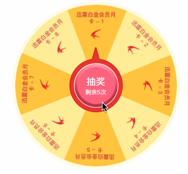

## 微信小程序抽奖组件


 **采用微信组件的方式提供，因组件内部使用了async/await，所以请在微信开发者工具"详情=》本地设置 勾上 增强编译和使用npm"，小程序npm使用方法请参考：[微信小程序-npm支持](https://developers.weixin.qq.com/miniprogram/dev/devtools/npm.html 'npm支持')**


**先看效果图：**



**使用步骤：**


* 步骤一：

  安装依赖或[前往githua下载源码](https://github.com/llf137224350/lottery-turntable-for-wx-miniprogram.git '源码')

  ````shell
  npm i lottery-turntable-for-wx-miniprogram
  ````

  

* 步骤二：

  页面JSON配置

  ```json
  {
    "usingComponents": {
      "lottery-turntable":"lottery-turntable-for-wx-miniprogram/lottery_turntable/index"
    }
  }
  ```

* 步骤三：

  准备数据和增加事件处理（使用组件页面JS）

  ````javascript
  const datas = [{
    "id": "792085712309854208",
    "imgUrl": "../../images/icon.png",
    "title": "迅雷白金会员月卡 - 1"
  }, {
    "id": "766410261029724160",
    "imgUrl": "../../images/icon.png",
    "title": "迅雷白金会员月卡 - 2"
  }, {
    "id": "770719340921364480",
    "imgUrl": "../../images/icon.png",
    "title": "迅雷白金会员月卡 - 3"
  }, {
    "id": "770946438416048128",
    "imgUrl": "../../images/icon.png",
    "title": "迅雷白金会员月卡 - 4"
  }, {
    "id": "781950121802735616",
    "imgUrl": "../../images/icon.png",
    "title": "迅雷白金会员月卡 - 5"
  }, {
    "id": "766411654436233216",
    "imgUrl": "../../images/icon.png",
    "title": "迅雷白金会员月卡 - 6"
  }, {
    "id": "770716883860332544",
    "imgUrl": "../../images/icon.png",
    "title": "迅雷白金会员月卡 - 7"
  }, {
    "id": "796879308510732288",
    "imgUrl": "../../images/icon.png",
    "title": "迅雷白金会员月卡 - 8"
  }];
  
  Page({
    data: {
      datas: datas, // 数据 
      prizeId: '',  // 抽中结果id，通过属性方式传入组件
      config: { 		// 转盘配置，通过属性方式传入组件
        titleLength: 7
      }
    },
    /**
     * 次数不足回调
     * @param e
     */
    onNotEnoughHandle(e) {
      wx.showToast({
        icon: 'none',
        title: e.detail
      })
    },
  
    /**
     * 抽奖回调
     */
    onLuckDrawHandle() {
      this.setData({
        prizeId: this.data.datas[Math.floor(Math.random() * 10 % this.data.datas.length)].id
      });
    },
  
    /**
     * 动画旋转完成回调
     */
    onLuckDrawFinishHandle() {
      const datas = this.data.datas;
      const data = datas.find((item) => {
        return item.id === this.data.prizeId;
      });
      wx.showToast({
        icon: 'none',
        title: `恭喜你抽中 ${data.title}`
      })
      this.setData({
        prizeId: ''
      });
    }
  })
  
  ````


* 步骤四：

  页面使用

  ````html
  <lottery-turntable
       data="{{datas}}"
       prize-id="{{prizeId}}"
       count="{{5}}"
       config="{{config}}"
       bindLuckDraw="onLuckDrawHandle"
       bindNotEnough="onNotEnoughHandle"
       bindLuckDrawFinish="onLuckDrawFinishHandle"
     ></lottery-turntable>
  ````

  

* 步骤五：

  更改组件配置项（以下为默认配置），通过config属性传入一个js对象

  ````js
  /**
   * ease: 取值如下
   * 'linear'  动画从头到尾的速度是相同的
   * 'ease'  动画以低速开始，然后加快，在结束前变慢
   * 'ease-in'  动画以低速开始
   * 'ease-in-out'  动画以低速开始和结束
   * 'ease-out'  动画以低速结束
   * 'step-start'  动画第一帧就跳至结束状态直到结束
   * 'step-end'  动画一直保持开始状态，最后一帧跳到结束状态
   */
  // 以下为默认配置
  let config = {
    size: {
      width: '572rpx',
      height: '572rpx'
    },                                      // 转盘宽高
    bgColors: ['#FFC53F', '#FFED97'],       // 转盘间隔背景色 支持多种颜色交替
    fontSize: 10,                           // 文字大小
    fontColor: '#C31A34',                   // 文字颜色
    titleMarginTop: 12,                     // 最外文字边距
    titleLength: 6                          // 最外文字个数
    iconWidth: 29.5,                        // 图标宽度
    iconHeight: 29.5,                       // 图标高度
    iconAndTextPadding: 4,                  // 最内文字与图标的边距
    duration: 8000,                         // 转盘转动动画时长
    rate: 1.5,                              // 由时长s / 圈数得到
    border: 'border: 10rpx solid #FEFAE4;', // 转盘边框
    ease: 'ease-out'                        // 转盘动画
  };
  ````

  


